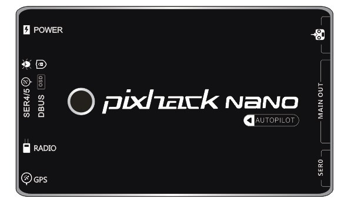
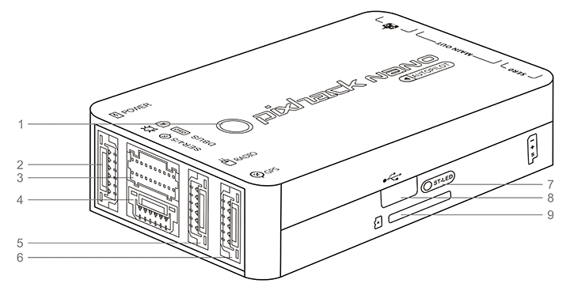
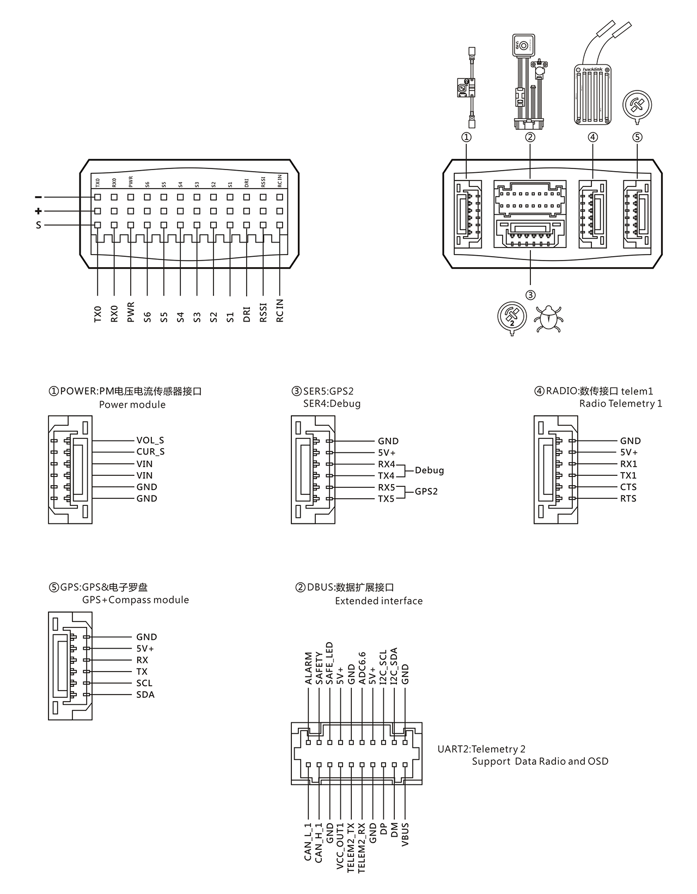

# PixHack NANO Autopilot {#pixhack-nano-飞控}

---

### Introduce {#介绍}

**Pixhack NANO** is a miniature autopilot designed and manufactured by CUAV.
The board is based on the **FMUv4** open hardware design. It is fully compatible with [PX4](http://px4-travis.s3.amazonaws.com/Firmware/master/px4fmu-v5_default.px4) and [ArduPilot](http://firmware.ardupilot.org) firmware. Mainly used for micro-unmanned aerial vehicles (copter/plane/helicopters).

The shell adopts aerospace aluminum alloy CNC molding process, the size is only 34X57MM, and the high-performance IMU inner damping system is realized in a narrow space.

6 PWM outputs, 2 mavlink devices, 2 GPS positioning systems, I2C device expansion, CAN device expansion, IV voltage current sensor,  debug interface

Built-in CM-20608 (six-axis sensor)\HMC5983L (three-axis electronic compass)\MS5611 (high-precision digital barometer) new high performance combination IMU.

#### Powerful processor {#强大处理器 }

Based on STM32F427 \(180MHZ\) master

#### Optimized design {#优化设计}

* abundant precision sensors \(including accelerometer, gyroscope, electronic compass, digital barometer\)

* The built-in sensor data fusion mechanism and failover mechanism in the software greatly reduce the chance of crashes caused by flight control.

#### Rich expansion {#丰富扩展}

Scalable 1 set of electronic compass, 1 smart battery, 2 sets of NMEA or UBX standard GPS, CAN bus device \(ESC\), 2 I2C devices \(smart battery, status light, optical flow smart camera, laser sensor, ultrasonic sensor, etc. \)

#### Built-in shock absorber system {#内置减震系统 }

Separate design of sensor and main board, built-in high-performance shock absorption system, Able to adapt to a variety of severe environments

### Technical specifications: {#技术规格}

---

|  | Hardware parameters |
| :--- | :--- |
| Main Processor Processor | STM32F427 |
|  |  |
| Sensor |  |
| Accelerometer | MPU9250/ICM-20608 |
| Gyro | ICM-20608 |
| Compass | HMC5983 |
| Barometer | MS5611 |
| Interface |  |
| Mavlink UART | 2（Hardware flow control） |
| GPS UART | 2 |
| DEBUG UART | 1 |
| Remote control signal input protocol | PPM/SBUS/DSM/DSM2 |
| RSSI | PWM or 3.3 analog voltage |
| I2C | 1 |
| CAN Standard bus | 1 |
| ADC input | 6.6V X1 |
| PWM ouput | standard 6 PWM IO |
|  |  |
| Support model |  |
|  | Plane / copter / helicopter / VTOL / rover etc. |
|  |  |
| Working environment and physical parameters |  |
| PM working voltage | 4.5 ~ 5.5 V |
| USB voltage | 5.0 V +- 0.25v |
| Servo voltage | 4.8~5.4V |
| working temperature | -20 ~ 60°c |
| **Size** |  |
| Long X Wide X High | 57\*34\*17mm |
| Weight | 40g |

### About NANO {# 认识NANO}

---

1: Status LED

2: POWER PM module

3: D-BUS data expansion interface

4: GPS2+DEBUG interface

5:radio data transmission interface

6: GPS+ compass interface

7: Start LED

8: micro USB

9: TF memory card

### Interface definition： {#接口定义}

