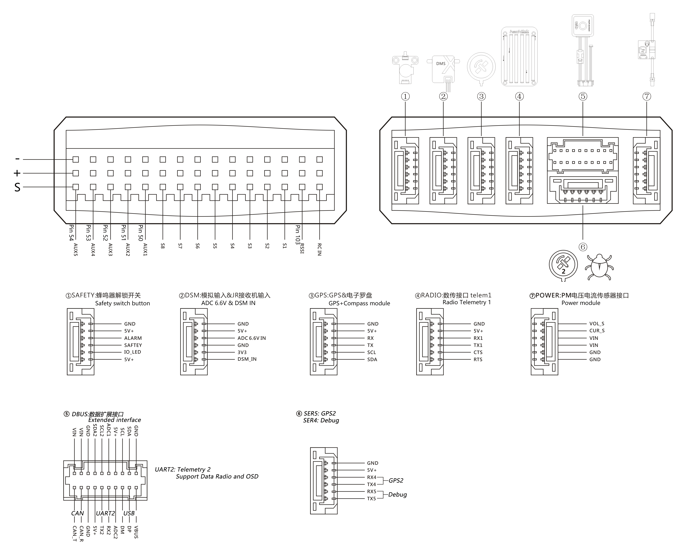

### Introduce {#介绍}

---

#### Cover all models {#覆盖全机型}

Pixhack v3 is an advanced autopilot designed and made in CUAV® .  
The board is is based on the FMUv3 open hardware design. It is fully compatible with [PX4](http://px4-travis.s3.amazonaws.com/Firmware/master/px4fmu-v5_default.px4) and [ArduPilot](http://firmware.ardupilot.org). intended primarily for academic and commercial develop.

Applicable model: plane\copter\helicopters\VTOL\unmanned vehicles unmanned boats.

#### Powerful processor {#强大处理器r}

Based on STM32F427 \(180MHZ\) master and STM32F100 coprocessor.

#### Redundant design {#冗余设计}

* Built-in 3 IMU Redundant Designs \(includes 3 accelerometers, 3 sets of gyroscopes, 2 sets of electronic compass, 2 sets of digital barometers\)

* Supports 3 sets of power supply redundant switching

* The built-in sensor data fusion mechanism and failover mechanism in the software greatly reduce the chance of crashes caused by flight control.

#### Enrich extension {#丰富扩展}

Scalable 1 set of electronic compass, 1 smart battery, 2 sets of NMEA or UBX standard GPS, CAN bus device \(ESC\), 2 I2C devices \(smart battery, status light, optical flow smart camera, laser sensor, ultrasonic sensor, etc.

#### Built-in shock absorber system {#内置减震系统}

Separate design of sensor and main board, built-in high-performance shock absorption system, a variety of severe model environment, better adaptability

#### Built-in IMU temperature automatic compensation system {#Built-in IMU temperature automatic compensation system}

Pixhack V3 recently is designed a digital temperature control system to keep the sensor in a constant temperature environment  in order to adapt to a more severe low temperature environment.

### Technical specifications {#技术规格}

---

|  | Hardware parameters |
| :--- | :--- |
| Main Processor | STM32F427 |
| Failsafe co-processor | STM32F100 |
| **Sensor** |  |
| ccelerometer 3 | LS303D\MPU6000\MPU9250 |
| Gyro 3 | L3GD20\MPU6000\MPU9250 |
| Compass 1 | LS303D |
| Barometer 2 | MS5611 X2 |
| **Interface** |  |
| Mavlink UART | 2 \(with hardware flow control\) |
| GPS UART | 2 |
| DEBUG UART | 1 |
| RC bsignal input protocol | PPM/SBUS/DSM/DSM2 |
| RSSI input | PWM or 3.3 analog voltage |
| I2C | 2 |
| CAN stander bus | 1 |
| ADC input | 3.3V X1 , 6.6V X1 |
| PWM output | Standard 8 PWM IO + 5 Programmable IOs |
|  |  |
| Support models |  |
|  | Plane / copter / helicopter / VTOL / rover etc. |
| Working environment and physical parameters |  |
| PM working voltage | 4.5 ~ 5.5 V |
| USB voltage | 5.0 V +- 0.25v |
| Servo voltage | 4.8~5.4V |
| working temperature | -20 ~ 60°c |
| Size |  |
| Length x width x height | 68\*44\*17 |
| Wegiht | 63g |

### Interface cognition {#接口认识 }

---

1.Main status led

2.boot led

3.Safe unlock switch

4.DSM remote control signal + ADC6.6 interface

5.GPS+COMPASS interface

6.Digital interface

7.Bus expansion interface

8.DEBUG interface + GPS2 interface

9.POWER IV sensor interface

10.Micro USB interface

11.TF card interface

12.FMU STM32F4 restart button

13.IO STMF100 restart button

### Interface definition {#接口定义}

---

