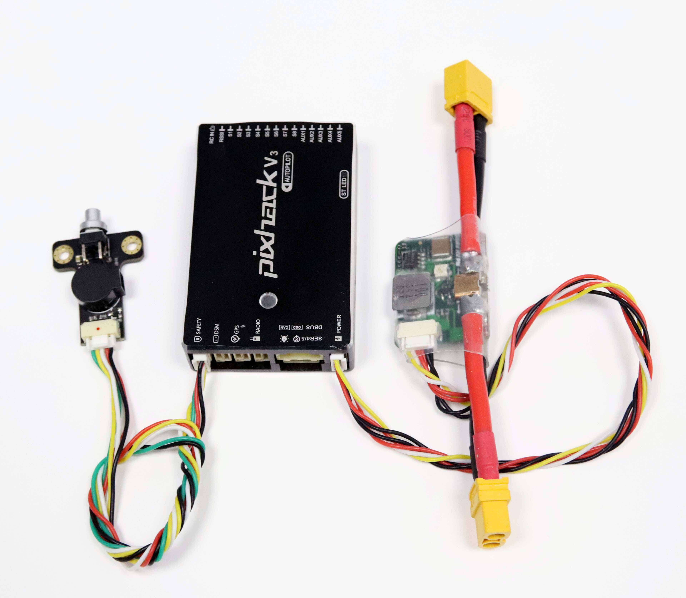
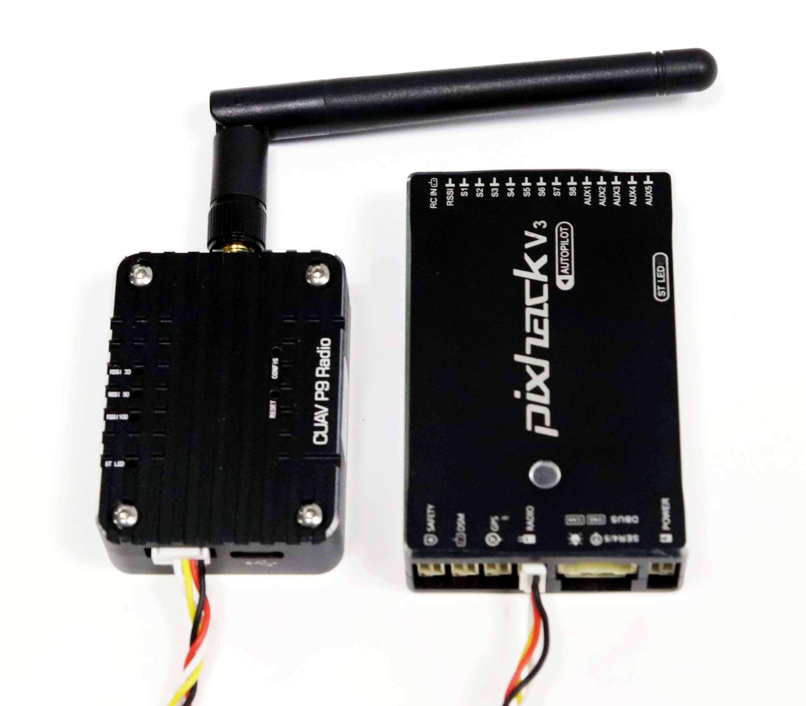
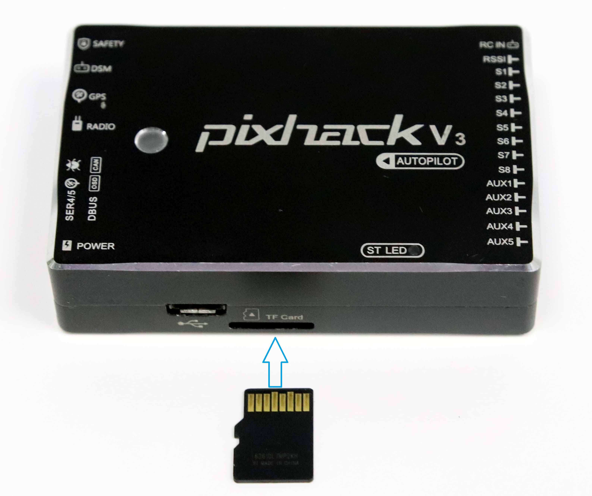

# Pixhack v3 wiring quick start

The quick start guide shows how to power the Pixhack V2/V3 flight controller and connect its most important peripherals.

### Mount and Orient Controller

Pixhack V2/V3/V3X should be mounted on the frame using vibration-damping foam pads (included in the kit). It should be positioned as close to your vehicle’s center of gravity as possible, oriented top-side up with the arrow pointing towards the front of the vehicle.

> **Note** If the controller cannot be mounted in the
  recommended/default orientation (e.g. due to space constraints) you will
  need to configure the autopilot software with the orientation that you
  actually used: [Flight Controller Orientation](https://docs.px4.io/en/advanced_features/rtk-gps.html).
  
### Wiring Overview

The image below shows how to connect the most important sensors and peripherals. We'll go through each of these in detail in the following sections.

### GPS + Compass

The GPS/Compass should be connected to the pixhack v3  GPS interface and placed as far away from other electronic devices as possible on the frame, with the direction marker facing the front of the vehicle (separating the compass from other electronic devices will reduce interference).

 

### Safety Switch and power

The **CUAV** safety switch is an integrated safety switch and buzzer and should be connected to the pixhack v3 safe interface;Power module should connect to pixhack v3 power interface.

 

### Telemetry radio

Telemetry radios may be used to communicate and control a vehicle in flight from a ground station (for example, you can direct the UAV to a particular position, or upload a new mission).One radio must be connected to your pixhack v3 raido port as shown below. The other is connected to your ground station computer or mobile device (usually by USB).

 

### SD Card (Optional)

SD cards are most commonly used to log and analyse flight details. Insert the card (included in Pixhack v3 kit) into Pixhack v3 as shown below.
 

### Radio Control

A remote control (RC) radio system is required if you want to manually control your vehicle.
You will need to select a compatible transmitter/receiver and then bind them so that they communicate (read the instructions that come with your specific transmitter/receiver).
Connect the Radio Control receiver to the Pixhack V3 rcin pin.. RC supports the PPM and the SBus.

### Motors

Motors/servos are connected to the **MAIN**(It is identified as S on Pixhack v3) and **AUX** ports in the order specified for your vehicle in the [Airframe Reference](../airframes/airframe_reference.md). 

### Pinouts

Pixhack v3 does not use standard Dronecode pins. The pinouts below is shown.
 