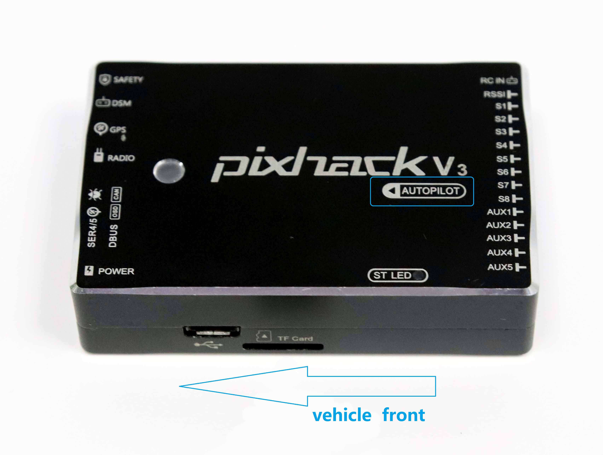
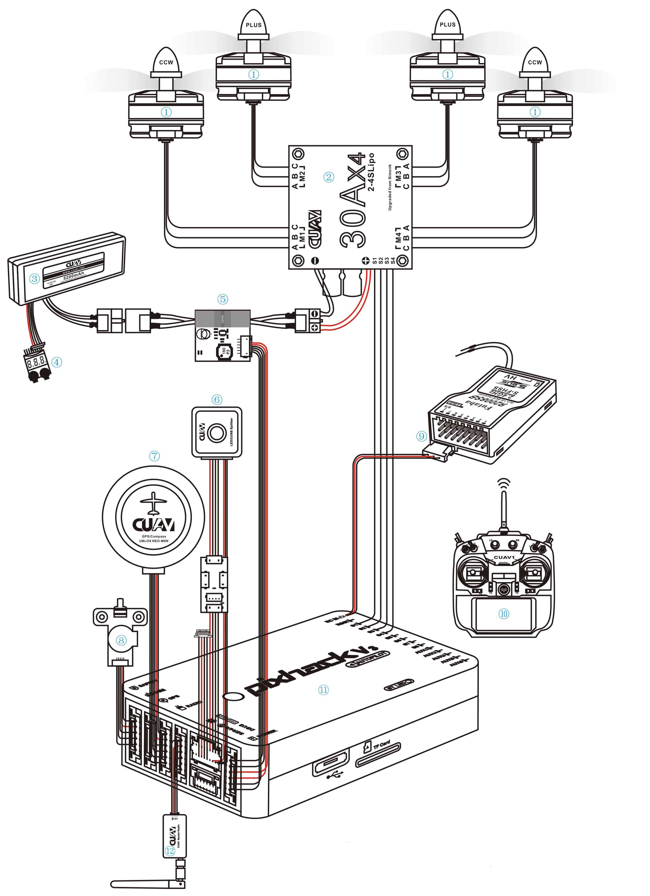
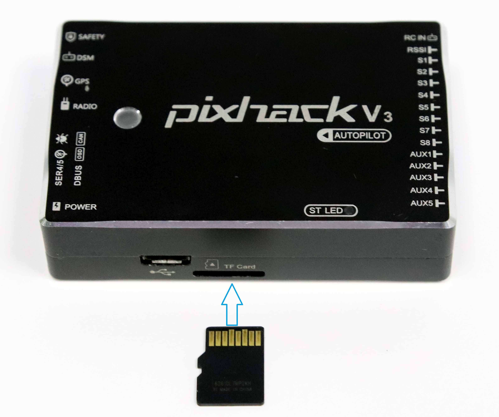

#Pixhack v3快速布线指南

快速入门指南介绍了如何为Pixhack V2 / V3飞行控制器供电并连接其外围设备。

### Mount和Orient Controller

Pixhack V2 / V3 / V3X应使用减震泡沫垫（包含在套件中）安装在框架上。它的位置应尽可能靠近车辆的重心，顶部朝上，箭头指向车辆前部。

> **注意**如果控制器无法安装在建议/默认方向（例如由于空间限制），您将需要以您的方向配置自动驾驶仪参数.

###接线概述

下图显示了如何连接最重要的传感器和外围设备。我们将在以下部分详细介绍其中的每一个。

### GPS +指南针

GPS /指南针应连接到pixhack v3 GPS接口，并尽可能远离框架上的其他电子设备，方向标记朝向车辆前方（将指南针与其他电子设备分开将减少干扰） 。

###安全开关和电源

** CUAV **安全开关是一个集成的安全开关和蜂鸣器，应连接到pixhack v3安全接口;电源模块应连接到pixhack v3电源接口。

###遥测无线电

遥测无线电可用于从地面站传送和控制飞行中的车辆（例如，您可以将UAV指向特定位置，或上传新任务）。一个无线电必须连接到您的pixhack v3 raido端口作为如下所示。另一个连接到地面站计算机或移动设备（通常通过USB）。

### SD卡（可选）

SD卡最常用于记录和分析航班详细信息。将卡（包含在Pixhack v3套件中）插入Pixhack v3，如下所示。

###无线电控制

如果要手动控制车辆，则需要遥控（RC）无线电系统。
您需要选择兼容的发送器/接收器，然后绑定它们以便它们进行通信（阅读特定发送器/接收器附带的说明）。
将无线电控制接收器连接到Pixhack V3 rcin引脚.RC支持PPM和SBus。

### 伺服（电机）输出

电机/伺服系统连接到** MAIN **（在Pixhack v3上标识为S）和** AUX **端口.
